  

  <samp>16 y/o</samp>

  
  
  

<h2 align="center">About Me</h2>

  

  <samp>
    ◦ Passionné de systèmes bas-niveau — kernels, bootloaders, x86 Assembly 
    ◦ Développeur civic tech : <strong>GwadloupAlert</strong>, plateforme de signalement citoyenne pour la Guadeloupe 
    ◦ Contributeur <strong>BuildTheEarth</strong> — reconstruction du monde en Minecraft à l'échelle 1:1 
    ◦ Un peu de tout... 
    ◦ Élève en Première · autodidacte · Guadeloupe 🌴
  </samp>

<h2 align="center">My Skills</h2>

<h4 align="center">>— Systems & Low-level</h4>

  
  
  
  
  
  
  

<h4 align="center">>— Cloud & DevOps</h4>

  
  
  
  

<h4 align="center">>— Frameworks & Libraries</h4>

  
  

<h4 align="center">>— Web & Backend</h4>

  

<h4 align="center">>— Databases</h4>

  

<h4 align="center">>— Geospatial</h4>

  
  
  
  
  

<h4 align="center">>— Tools & Design</h4>

  
  
  
  
  
  
  

<h2 align="center">GitHub Stats</h2>

  
  

  

